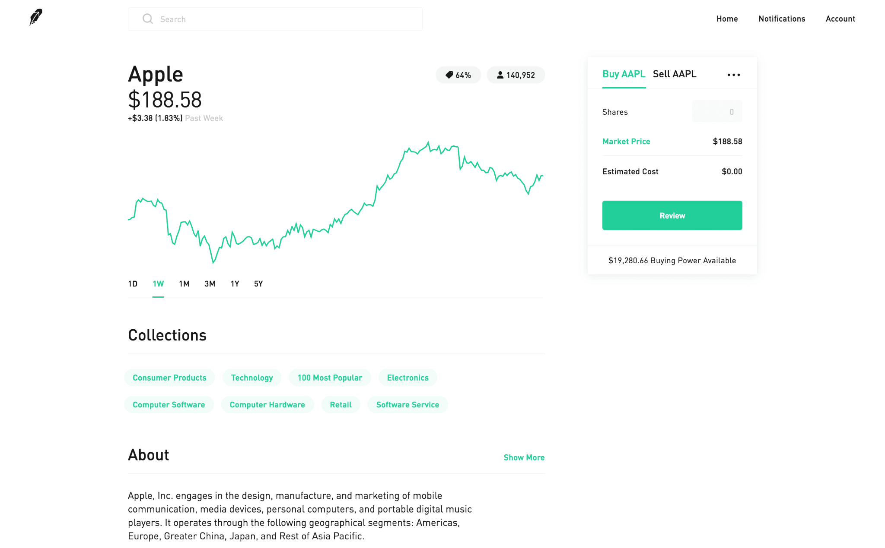

### Setup users, accounts and stock instruments

`pgworkload run -w tradeaccounts.py -c 4 --url 'postgres://root@localhost:26257/trade_db?sslmode=disable&application_name=trade_db' -d 15 -i 100000`

### Run orders 

`pgworkload run -w tradeorder.py -c 8 --url 'postgres://root@localhost:26257/trade_db?sslmode=disable&application_name=trade_db' -d 15 -i 100000`

### Run order_processing

`pgworkload run -w tradeprocessor.py -c 1 --url 'postgres://root@localhost:26257/trade_db?sslmode=disable&application_name=processor' -d 15 -i 30000`

### Sample instruments Data

  symbol |    name    | current_price |          created_at
---------+------------+---------------+--------------------------------
  AABI   | fSxmqVSeKx |        892.73 | 2024-05-21 14:48:34.364347+00
  AANM   | dgOkHNMzOK |        799.75 | 2024-05-21 14:48:40.050032+00
  AAQT   | bJkJcaOXTO |        160.82 | 2024-05-21 14:48:34.372337+00
  ABEK   | BVYBlpspcR |        979.86 | 2024-05-21 14:48:37.227691+00
  ABIK   | RcADRvkHWg |        263.12 | 2024-05-21 14:48:37.283642+00

## Trading App 

# Trade app SQL Info 

- Use the `trade.sql` file to create schema 
- Use the `trade_sample_insert.sql` to do some quick inserts 
